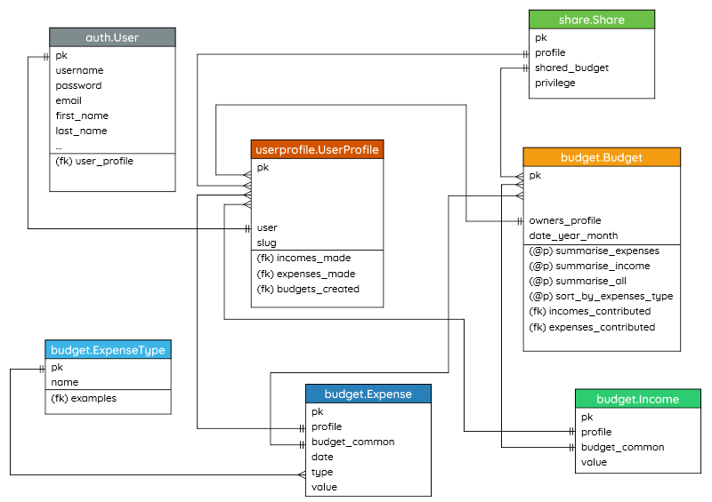
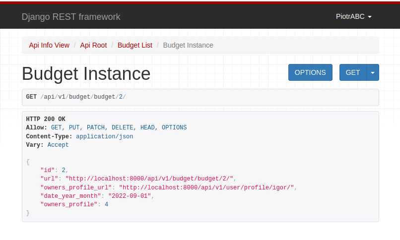
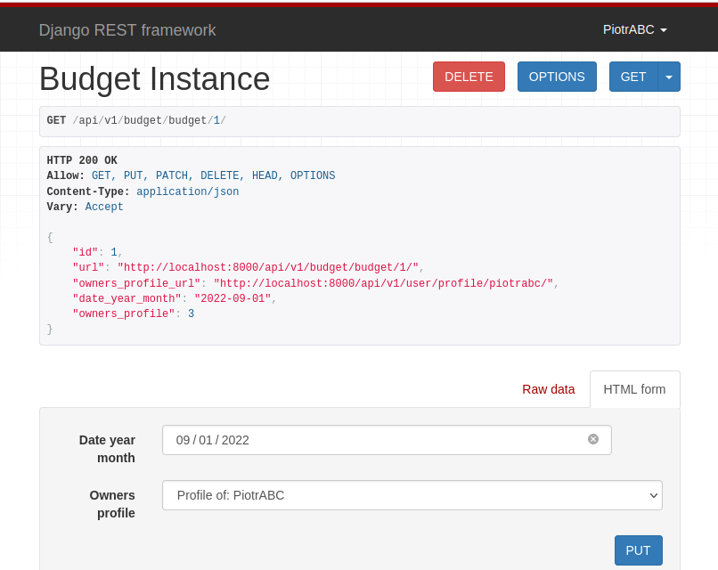

# FamiliBudget

Budget app to control your incomes and expenses. Setup budget, share it with family members. Done using Django, Django REST Framework and Docker Compose.



## Instalation Linux

Install Docker and Docker Compose:

```commandline
sudo apt-get install docker 
sudo apt-get install docker-compose-plugin
```

Download repo using Git and move inside downloaded folder:

```commandline
git clone https://github.com/Gieneq/FamiliBudget.git
cd FamiliBudget/
```

Run Docker Copmpose:
```commandline
docker-compose up --build
```

After completion check running containers:
```commandline
sudo docker ps
```
It will look like this:
```
CONTAINER ID   IMAGE               COMMAND                  CREATED          STATUS          PORTS                                       NAMES
125a62cfa4b1   family_budget_web   "bash -c 'python man…"   36 seconds ago   Up 35 seconds   0.0.0.0:8000->8000/tcp, :::8000->8000/tcp   family_budget_web_1
dd133aebe476   postgres            "docker-entrypoint.s…"   13 hours ago     Up 35 seconds   5432/tcp                                    family_budget_db_1
```
You can check if current location (workdir) is the same as in Dockerfile /code by typing:
```commandline
sudo docker exec -it 12 pwd
```

## Setup data
We will use running container with web app. It's IP changes. You can use at least several first representative characters of ID.

First migrate models:
```commandline
sudo docker exec -it 12 python manage.py migrate
```

Create superuser:
```commandline
sudo docker exec -it 12 python manage.py createsuperuser
```

Load data fixtures to prefeed database using fixtures.json file. It should be inlcuded to the container. You can check it using ls:
```commandline
sudo docker exec -it 12 ls -lah | grep fix
```
As a result you'l get similar files:
- first is manually setup,
- second is generated using dumpdata command.

```text
-rw-rw-r--  1 1000 1000 3.1K Sep 17 13:22 fixtures.json
-rw-rw-r--  1 1000 1000  21K Sep 19 13:33 fixtures_dumped.json
```
To load fixtures run:
```commandline
sudo docker exec -it 12 python manage.py loaddata fixtures.json
```

## Tests
Tests are done using django TestCase framework which is based on Pythons unittest. To execute unit tests type:

```commandline
sudo docker exec -it 12 python manage.py test
```
It will look for all test.py in apps folders. It should throw 'OK':
```text
Found 19 test(s).
Creating test database for alias 'default'...
System check identified no issues (0 silenced).
...................
----------------------------------------------------------------------
Ran 19 tests in 0.691s

OK
Destroying test database for alias 'default'...
```

## API
To access browsable API visit URL: http://localhost:8000/api/v1/
It'l show all main routs:
```JSON

{
    "user": "http://localhost:8000/api/v1/user/",
    "profile": "http://localhost:8000/api/v1/user/profile/",
    "share": "http://localhost:8000/api/v1/share/",
    "budget": "http://localhost:8000/api/v1/budget/budget/",
    "expensetype": "http://localhost:8000/api/v1/budget/expensetype/",
    "expense": "http://localhost:8000/api/v1/budget/expense/",
    "income": "http://localhost:8000/api/v1/budget/income/"
}
```
Then you can try visiting further pats. Most of views are made using Routers and ViewSets, but User and UserProfile are quite different.
First thing is that to extend User One To One relation was made with UserProfile model.
At User creation there is emitted signal which creates UserProfile, so user and UserProfile exists together.
Because of that UserProfile is ViewOnly and User can be modified. 
Second UserProfile url pattern is made using unique slug - it helps browsing by looking at URL. It is not needed for Expenses and Budgets.
Third User has password - it can be edited using special endpoint.

There are routes used to manipulate User:
```JSON
{
  "user-list": "http://localhost:8000/api/v1/user/",
  "user-create": "http://localhost:8000/api/v1/user/add/",
  "user-detail": "http://localhost:8000/api/v1/user/<slug>/"
}
```
And routes used to examine UserProfile:
```JSON
{
  "userprofile-list": "http://localhost:8000/api/v1/user/profile/",
  "userprofile-list": "http://localhost:8000/api/v1/user/profile/",
  "userprofile-detail": "http://localhost:8000/api/v1/user/profile/<slug>/",
  "userprofile-delete": "http://localhost:8000/api/v1/user/profile/<slug>/delete/",
  "userprofile-edit": "http://localhost:8000/api/v1/user/profile/<slug>/edit/",
  "userprofile-changepassword": "http://localhost:8000/api/v1/user/profile/<slug>/pswd/",
  "userprofile-budgets": "http://localhost:8000/api/v1/user/profile/<slug>/budgets/"
}
```

## Permissions
There are applied permissions:
- staff memebe can manipulate all data,
- creator can manage his own content despite Share objects. Share is quite tricky so obly option is to delete Share by User who is sharing or User which is given access.
- unauthorized access is given ReadOnly permission

Here user is not creator so has only ReadOnly permissions:


Here user is also creator of this content and can edit:


## Authentication
Django has 2 basic types of authentication:

### Session Authentication
Used in browsable API with login option enabled:
```Python
    path('api-auth/', include('rest_framework.urls')),
```

### Basic Authentication
Simple raw user/password authentication not recommended in production. HTTPS is a musthave because password is sent to backend without any encryption.

For example lets create user and try modifying using authentication credentials:
```commandline
http POST http://127.0.0.1:8000/api/v1/user/add/ username=Tester password=testing1234 password2=testing1234
```
Successful result:
```text
HTTP/1.1 201 Created
Allow: POST, OPTIONS
Content-Length: 46
Content-Type: application/json
Cross-Origin-Opener-Policy: same-origin
Date: Tue, 20 Sep 2022 02:00:12 GMT
Referrer-Policy: same-origin
Server: WSGIServer/0.2 CPython/3.10.7
Vary: Accept, Cookie
X-Content-Type-Options: nosniff
X-Frame-Options: DENY

{
    "password": "testing1234",
    "username": "Tester"
}
```

Ten editing:

```commandline
http -a Tester:testing1234 PUT http://127.0.0.1:8000/api/v1/user/tester/edit/ email='tester@gmail.com' username='Tester'
```
with result:
```text
HTTP/1.1 200 OK
Allow: PUT, PATCH, OPTIONS
Content-Length: 79
Content-Type: application/json
Cross-Origin-Opener-Policy: same-origin
Date: Tue, 20 Sep 2022 02:02:13 GMT
Referrer-Policy: same-origin
Server: WSGIServer/0.2 CPython/3.10.7
Vary: Accept, Cookie
X-Content-Type-Options: nosniff
X-Frame-Options: DENY

{
    "email": "tester@gmail.com",
    "first_name": "",
    "last_name": "",
    "username": "Tester"
}
```

## API Client with requests

Inside 'client_cli' folder there is requests based Python API client. There are 3 commands:
- **python3 client.py status [-v]**, status code 200 means web app is running,
- **python3 client.py register**, register user with username and repeated password,
- **python3 client.py email <email>, change email of user.

For example changing email results: 
```text
    |----------------------------------------------------------|
    |                   FamilyBudget Client                    |
    |----------------------------------------------------------|
(<Response [200]>, b'{"username":"Tomek","email":"abc@gmail.com","first_name":"","last_name":""}')
```

## Difficulties & todo
Using Money field which combines DecimalField and currency string made some problems:
- despite addition possibility it sometimes rolls back to DecimalField,
- it is not easy to serialize.

Because of that several aggregation properties of Budget model are not present in API:
```python
    def summarise_expenses(self):

    def summarise_incomes(self):

    def summarise_all(self):

    def sort_by_expenses_type(self):
```

They aggregates expenses and incomes to one value. Last function is used to sum expenses among categories. It works fine in unit test, but there is problem with serializer.

